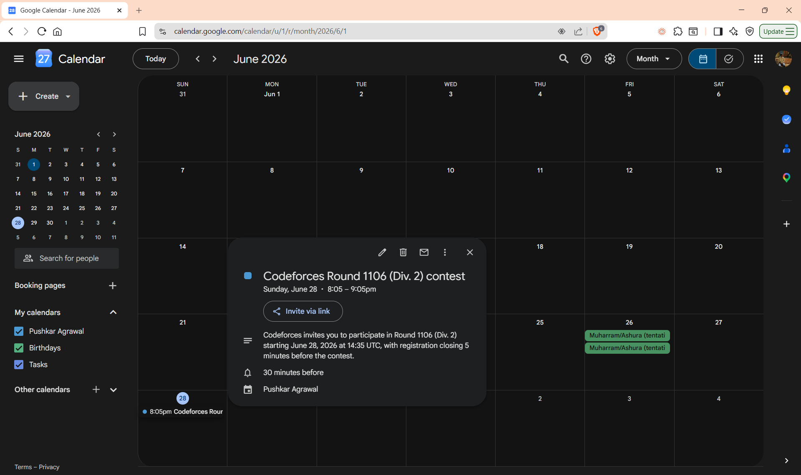
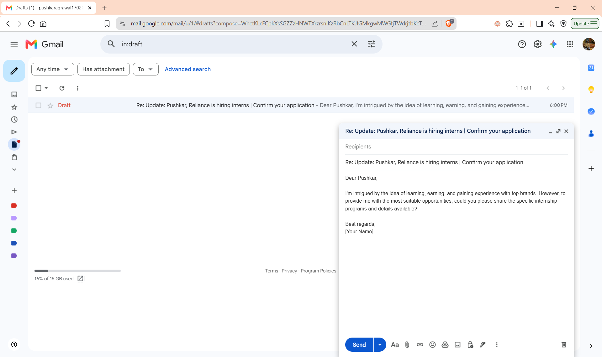
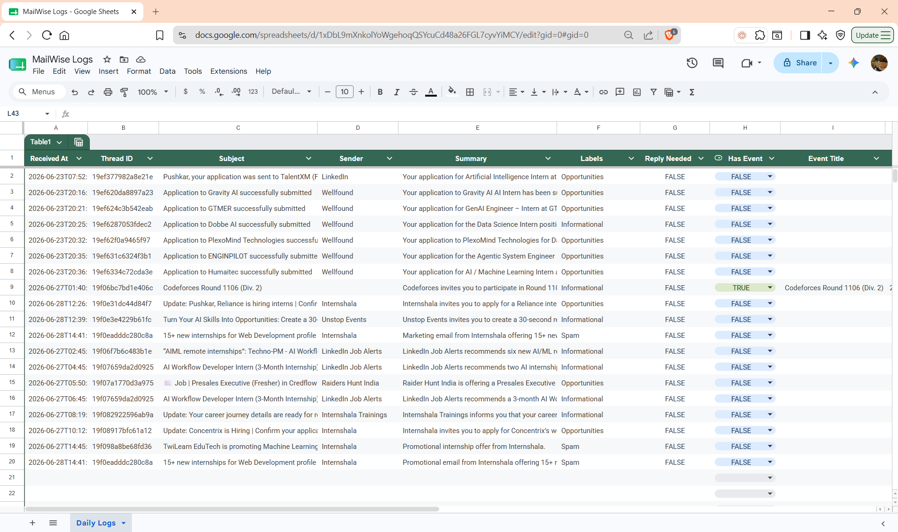
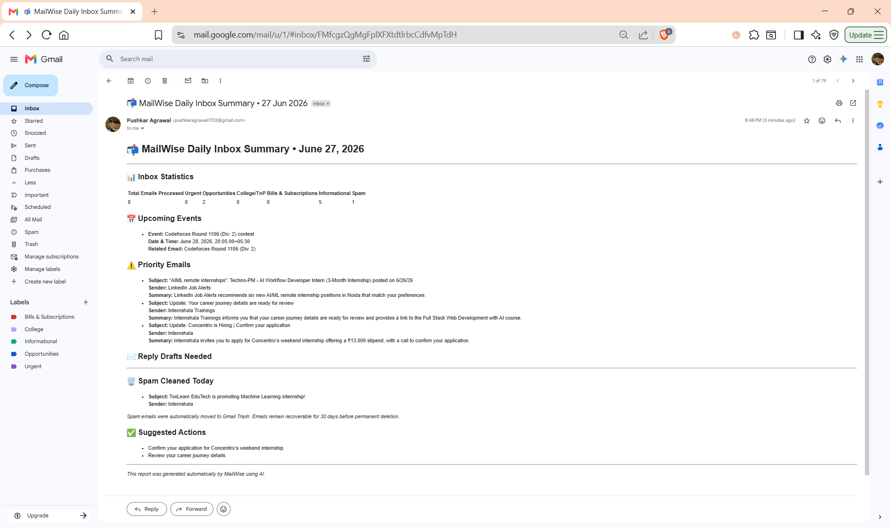
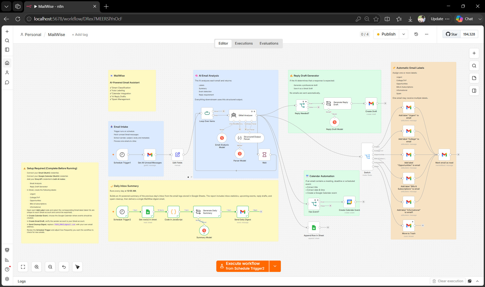

# 📬 MailWise

<p align="center">


</p>

MailWise is an AI-powered email management workflow built with **n8n** that helps you keep your inbox organized without manual effort.

It automatically categorizes emails, creates calendar events from important dates, generates AI-powered reply drafts, logs processed emails to Google Sheets, and delivers a daily inbox summary so you never miss what matters.

---

# ✨ Features

### 📩 Smart Email Classification

Automatically categorizes incoming emails into:

* Urgent
* College/TnP
* Opportunities
* Bills & Subscriptions
* Informational
* Spam

---

### 📅 Automatic Calendar Events

Detects:

* Interviews
* Meetings
* Deadlines
* Contests
* Other scheduled events

and automatically creates Google Calendar events.

<p align="center">

</p>

---

### ✍ AI Reply Drafts

When an email requires your response, MailWise generates a professional draft and saves it directly to Gmail Drafts.

<p align="center">

</p>

---

### 📊 Email Logging

Every processed email is logged into Google Sheets for tracking and reporting.

Logged information includes:

* Sender
* Subject
* Labels
* Summary
* Reply Needed
* Event Information
* Timestamp

<p align="center">

</p>

---

### 🌙 Daily Inbox Summary

Every night, MailWise generates an AI-powered digest containing:

* Inbox statistics
* Upcoming events
* Priority emails
* Pending replies
* Spam cleaned
* Suggested action items

<p align="center">

</p>

---

# ⚙ Workflow

The entire automation runs as a **single n8n workflow**.

<p align="center">
  
</p>

```text
                            Every Hour
                                │
                                ▼
                        Fetch Unread Emails
                                │
                                ▼
                        AI Email Analysis
                                │
                ┌───────────────┼──────────────────────┐
                │               │                      │
                ▼               ▼                      ▼
          Google Sheets    Calendar Event         Reply Draft
             Logging         Detection             Detection
                │               │                      │
                │         Create Calendar        Create Gmail
                │             Event                 Draft
                │
                ▼
       Label Routing (Switch)
                │
     ┌──────────┼────────────┬───────────┬──────────┐
     ▼          ▼            ▼           ▼          ▼
  Urgent    College    Opportunities   Bills  Informational
     │          │            │           │          │
     └──────────┴────────────┼───────────┴──────────┘
                             │
                             ▼
                       Spam Cleanup
                             │
                             ▼
                    Mark Email as Read


                     Every Day (12:05 AM)
                              │
                              ▼
                   Read Google Sheets Logs
                              │
                              ▼
                     Generate Statistics
                              │
                              ▼
                      AI Daily Summary
                              │
                              ▼
                      Email Daily Digest
```


---

# 🛠 Tech Stack

| Category   | Technology                                |
| ---------- | ----------------------------------------- |
| Automation | n8n                                       |
| LLM        | Groq (GPT-OSS 20B & Llama 3.1 8B Instant) |
| Email      | Gmail API                                 |
| Calendar   | Google Calendar API                       |
| Database   | Google Sheets                             |
| Deployment | Docker                                    |

---

# 📁 Repository Structure

```text
MailWise
│
├── MailWise.json
├── screenshots
│   ├── workflow.png
│   ├── calender-event.png
│   ├── reply-draft.png
│   ├── google-sheet.png
│   └── daily-digest.png
│
├── .env.example
└── README.md
```

---

# 🚀 Getting Started

## 1. Clone the repository

```bash
git clone https://github.com/<your-username>/MailWise.git

cd MailWise
```

---

## 2. Start n8n

```bash
docker run -d \
  --name n8n \
  -p 5678:5678 \
  -e GENERIC_TIMEZONE="Asia/Kolkata" \
  -e TZ="Asia/Kolkata" \
  -v n8n_data:/home/node/.n8n \
  docker.n8n.io/n8nio/n8n
```

Open:

```text
http://localhost:5678
```

---

## 3. Import the workflow

Import **MailWise.json** into n8n.

---

## 4. Configure Credentials

Create the following credentials inside n8n:

* Gmail OAuth2
* Google Calendar OAuth2
* Google Sheets OAuth2
* Groq API

---

## 5. Gmail Labels

Create these labels:

* Urgent
* College/TnP
* Opportunities
* Bills & Subscriptions
* Informational

Spam emails are automatically moved to Trash.

---

## 6. Final Configuration

* Connect your Google Sheet.
* Configure the recipient email for the daily summary.
* Select the Gmail labels in each **Add Label** node.

---

# 📂 Environment Variables

See **.env.example**.

---

# 💡 Future Improvements

* Weekly & Monthly inbox reports
* Priority score for emails
* Follow-up reminders
* Duplicate calendar event detection
* Analytics dashboard
* Slack / Discord notifications

---

# 🤝 Contributing

Contributions, suggestions and feature requests are always welcome.

If you'd like to improve MailWise, feel free to fork the repository and open a pull request.

---

## Author

**Pushkar Agrawal**
B.Tech CSE — Jaypee Institute of Information Technology, Noida (2024–2028)

[GitHub](https://github.com/PushkarAgrawal17) · [LinkedIn](https://linkedin.com/in/pushkaragrawal17)
